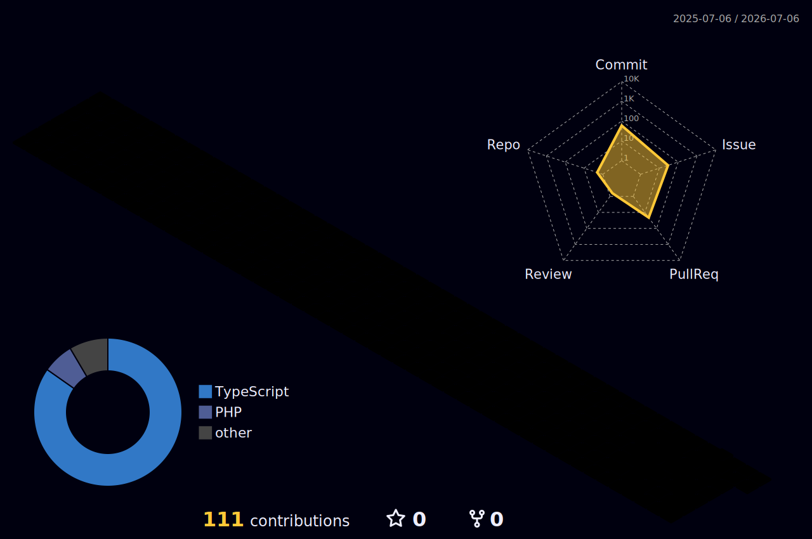

<!-- ╔══════════════════════════════════════════════════════════╗ -->
<!-- ║   RikiFukushima — GitHub Profile README (Neon / Gamer)    ║ -->
<!-- ╚══════════════════════════════════════════════════════════╝ -->

<!-- =================== ヘッダー（タイピングアニメーション） =================== -->
<div align="center">

[](https://git.io/typing-svg)

<!-- ネオンの区切り線 -->


</div>

<!-- =================== バッジ行（訪問者数・フォロワー） =================== -->
<div align="center">


[](https://github.com/RikiFukushima?tab=followers)

</div>

---

<!-- =================== 自己紹介 =================== -->
##  About Me

```ts
const riki = {
  role: "Frontend Engineer",
  stack: ["TypeScript", "JavaScript", "React", "Next.js"],
  currentlyBuilding: "textbook-gen",
  philosophy: "Clean code, neon vibes ⚡",
};
```

- 🔭 いま作っているもの: **[textbook-gen](https://github.com/RikiFukushima/textbook-gen)**
- 🌱 TypeScript / React を中心にフロントエンドを書いています
- ⚡ きれいで読みやすいコードが好きです

---

<!-- =================== 技術スタック =================== -->
## 🛠️ Tech Stack

<div align="center">


</div>

---

<!-- =================== GitHub 統計（ネオンテーマ） =================== -->
## 📊 GitHub Stats

<div align="center">


</div>

<div align="center">

<!-- 連続コミット日数（ストリーク） -->


</div>

---

<!-- =================== アチーブメント =================== -->
## 🏆 Achievements

<div align="center">


</div>

---

<!-- =================== コントリビューショングラフ =================== -->
## 📈 Contribution Graph

<div align="center">

[](https://github.com/ashutosh00710/github-readme-activity-graph)

</div>

---

<!-- =================== 3D コントリビューション（草を立体表示） =================== -->
<!-- ↓ 画像は GitHub Actions（.github/workflows/profile-3d.yml）が毎日自動生成します -->
## 🌌 3D Contribution

<div align="center">



</div>

---

<!-- =================== フッター =================== -->
<div align="center">


</div>
